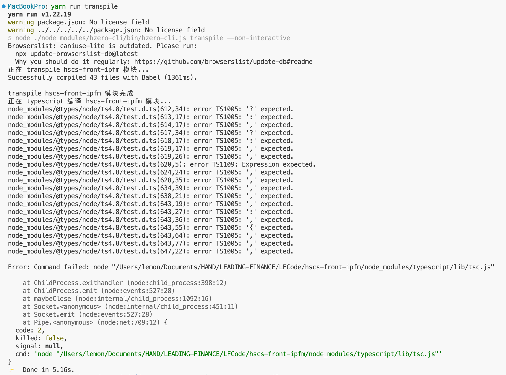

## undefined error in ... node_modules/@types/lodash/common/object.d.ts

**问题详情**


**解决方案**

版本过高导致此问题

```json title=package.json
{
  "resolutions": {
    "@types/lodash": "4.14.182"
  }
}
```

## node_modules/@types/node/ts4.8/test.d.ts(612,34): error TS1005: '?' expected.

**问题详情**

执行 `yarn run transpile` 时遇到此问题



**解决方案**

版本过高导致此问题

```json title=package.json
{
  "resolutions": {
    "@types/node": "18.11.18"
  }
}
```

## Attempted import error: 'createSpin' is not exported from '@hero-front-ui/core'

**详情**


**原因**

`@hero-front-ui/core` 与 `@hero-front-ui/c7n-ui` 版本不匹配，`c7n-ui@4.1.2` 版本中组件引入发生了变化

```js
// @hero-front-ui/c7n-ui@4.1.1
import { createSpin } from '../Spin';

// @hero-front-ui/c7n-ui@4.1.2
import { createSpin } from '@hero-front-ui/core';
```

**解决方案**

```json title=package.json
{
  "resolutions": {
    "@hzero-front-ui/c7n-ui": "4.1.1"
  }
}
```

## 接口平台部分接口不通

后端 `1.9.3-RELEASE` 版本，前端需要使用 `hzero-front-hitf@1.9.1` 或更低版本。
