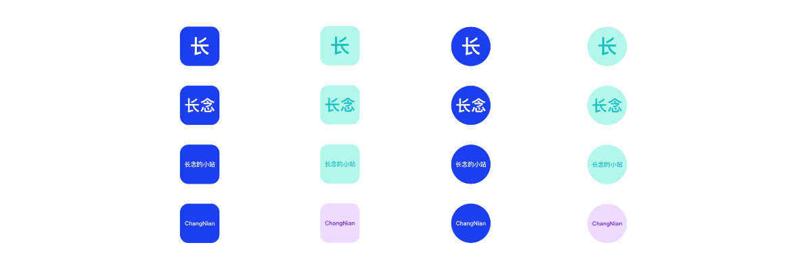

基于 `Avatar` 组件封装的头像组件。



## 特性说明

- 支持文字多彩模式
- 修复默认的 `Avatar` 组件缩放比例导致的文字倒置问题
- 支持 `AvatarProps` 所有属性

## 基本用法

```jsx {3} showLineNumbers
export default () => {
  return (
    <AvatarPro colorful size={28} style={{ fontSize: 14 }}>
      长念
    </AvatarPro>
  );
};
```

## 头像组

> 由于 `Group` 中用到的组件是原始的 `Avatar`，所以也存在倒置问题，建议自定义实现 `Group` 功能。

```tsx
import { Avatar } from 'choerodon-ui';
import { AvatarPro } from '@/components';

export default () => {
  return (
    <Avatar.Group maxCount={2} size={28} maxStyle={{ fontSize: 16 }}>
      <AvatarPro colorful size={28} style={{ fontSize: 16 }}>
        长念
      </AvatarPro>
      <AvatarPro colorful size={28} style={{ fontSize: 16 }}>
        长念的小站
      </AvatarPro>
      <AvatarPro colorful size={28} style={{ fontSize: 16 }}>
        ChangNian
      </AvatarPro>
    </Avatar.Group>
  );
};
```

## API

> 除此以下附加属性外，支持 `Avatar` 默认所有属性 `AvatarProps`

| 参数     | 类型         | 说明                                                                               | 默认值      |
| :------- | :----------- | :--------------------------------------------------------------------------------- | :---------- |
| children | `string`     | <Highlight>可选</Highlight> 文本，仅支持 `string`                                  | -           |
| colorful | `boolean`    | <Highlight>可选</Highlight> 是否启用多彩显示，仅 `children` 为 `string` 类型时有效 | `false`     |
| mode     | `AvatarMode` | <Highlight>可选</Highlight> 文本截取模式，枚举                                     | `full_char` |

### AvatarMode

```ts
export enum AvatarMode {
  FirstChar = 'first_char',
  First2Char = 'first_2char',
  LastChar = 'last_char',
  Last2Char = 'last_2char',
  FullChar = 'full_char',
}
```

## 源代码

继承 `Avatar` 组件，覆盖 `setScale` 方法修复文字缩放倒置问题。

:::info 说明
`AvatarP` 组件是为了修复文字缩放倒置问题，也可以导入使用，`AvatarPro` 中就是以修复过后的 `AvatarP` 作为基础组件的。
:::

```tsx {11-14,18} showLineNumbers title=AvatarP.tsx
import { Avatar } from 'choerodon-ui';
import { findDOMNode } from 'react-dom';
import { AvatarProps } from 'choerodon-ui/lib/avatar';
import { AvatarContextValue } from 'choerodon-ui/lib/avatar/AvatarContext';

export default class AvatarP extends Avatar {
  constructor(props: AvatarProps, context: AvatarContextValue) {
    super(props, context);
    this.state = {
      scale: 0.99999, // 避免等于1
      isImgExist: true,
    };
  }

  // 覆盖原方法：修复图像缩放问题
  setScale = () => {
    // eslint-disable-next-line react/no-find-dom-node
    const avatarNode = findDOMNode(this) as HTMLElement;
    if (avatarNode) {
      const childNode = avatarNode.firstChild as HTMLElement;

      const [avatarWidth, childWidth] = [
        avatarNode.offsetWidth || avatarNode?.getBoundingClientRect()?.width,
        childNode.offsetWidth || childNode?.getBoundingClientRect()?.width,
      ];

      if (avatarWidth > 8 && avatarWidth - 8 < childWidth) {
        this.setState({
          scale: (avatarWidth - 8) / childWidth,
        });
      }
    } else {
      this.setState({ scale: 0.99999 });
    }
  };
}
```

## 更新日志

### 2023-05-15

- 新增 `AvatarP` 组件修复原组件缩放导致的倒置问题；
- `children` 类型校验输出由错误调整为警告；
