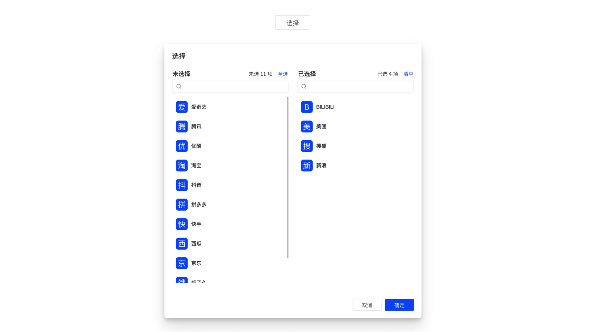

基于 `TransferPro` 实现，将 `Modal.open` 操作内置到组件中，渲染为 `Button` 组件。



## 特性说明

- 支持 `TransferPro` 所有特性
- 内建弹窗支持

## 基本用法

```tsx {5,15-17} showLineNumbers
import { TransferProLov } from 'hscs-common/components';

export default () => {
  const handleAssign = async ({ originalData, initialData, value, created, deleted }) => {
    console.log(originalData, initialData, value, created, deleted);
    // call save api
  };

  return (
    <TransferProModal
      buttonProps={{
        funcType: FuncType.link,
        disabled: true,
      }}
      modalProps={{
        onOk: handleAssign,
      }}
      titles={['未分配租户', '已分配租户']}
      configProps={{
        primaryKey: 'tenantId',
        textField: 'tenantName',
        valueField: 'tenantNum',
        lovCode: 'HPFM.TENANT_PAGING',
        lovUrl: 'sql',
      }}
      targetProps={{
        primaryKey: 'assignTenantId',
        read: ({ data }) => {
          return {
            url: `${IPFM_API_PREFIX_BASE}/model-assigns`,
            method: 'GET',
            data: { ...data, modelId: record?.get('modelId') },
          };
        },
      }}
    >
      分配
    </TransferProModal>
  );
};
```

## API

| 参数        | 类型               | 说明                                                                                                                                                                                                       | 默认值 |
| :---------- | :----------------- | :--------------------------------------------------------------------------------------------------------------------------------------------------------------------------------------------------------- | :----- |
| buttonProps | `ButtonProps`      | <Highlight>可选</Highlight> 按钮属性，默认 onClick 是打开弹窗，如果传入 onClick 事件，会先执行                                                                                                             | -      |
| modalProps  | `TModalProps`      | <Highlight>可选</Highlight> 基于弹窗属性 [ModalProps](https://open.hand-china.com/choerodon-ui/zh/procmp/feedback/modal#API)，`key` `children` 除外，`onOk` 事件回调中会注入参数，[详细](#tmodalpropsonok) | -      |
| 其他        | `TransferProProps` | 支持 `TransferProProps` 所有属性，详见 [TransferProProps](/docs/C7N/CustomComponents/transfer-pro#api)                                                                                                     | -      |

### ButtonProps.onClick

组件默认的 `onClick` 事件会打开弹窗，如果同时指定了 `onClick` 事件回调(异步)，则会先执行。

### TModalProps.onOk

`onOk` 回调中会注入以下参数：

| 参数         | 说明                                                                             |
| :----------- | :------------------------------------------------------------------------------- |
| originalData | <Highlight>数组</Highlight> 原始数据，目标数据源接口的返回数据                   |
| initialData  | <Highlight>数组</Highlight> 初始化数据，由 `originalData` 与源数据匹配之后的数据 |
| value        | <Highlight>数组</Highlight> 当前已选择的所有值                                   |
| created      | <Highlight>数组</Highlight> `value` 与 `initialData` 对比，新增的数据            |
| deleted      | <Highlight>数组</Highlight> `value` 与 `initialData` 对比，删除的数据            |

## Q & A

**1. 怎么理解 `originalData` 与 `initialData`**

示例：现在存在两个实体教师 (`Teacher`) 和教室 (`ClassRoom`)，两者之间存在多对多的关系。

```js
// 实例
teacher1 = { tid: 't01', tName: 'Sir' };
teacher2 = { tid: 't02', tName: 'Madam' };
classRoom = { cid: 'c01', tName: 'Class A' };

// 假设存在这样一条匹配关系
relation = { tid: 't01', cid: 'c01' };
```

在为教室分配教师的情况下，穿梭框的数据就是教师，`configProps` 的配置用来加载所有教师数据，`targetProps` 配置用来加载已匹配的关系数据。<br/>
`originalData` 就是这里的匹配关系原始数据；`initialData` 就是用 `originalData` 中的主键 `tid` 去匹配所有教师，将已包含的教师数据作为穿梭框【已选数据】，剩余部分作为穿梭框【源数据】

## 更新日志

### 0.1.1

- `hscs-front-common@0.1.1` 起支持该组件
