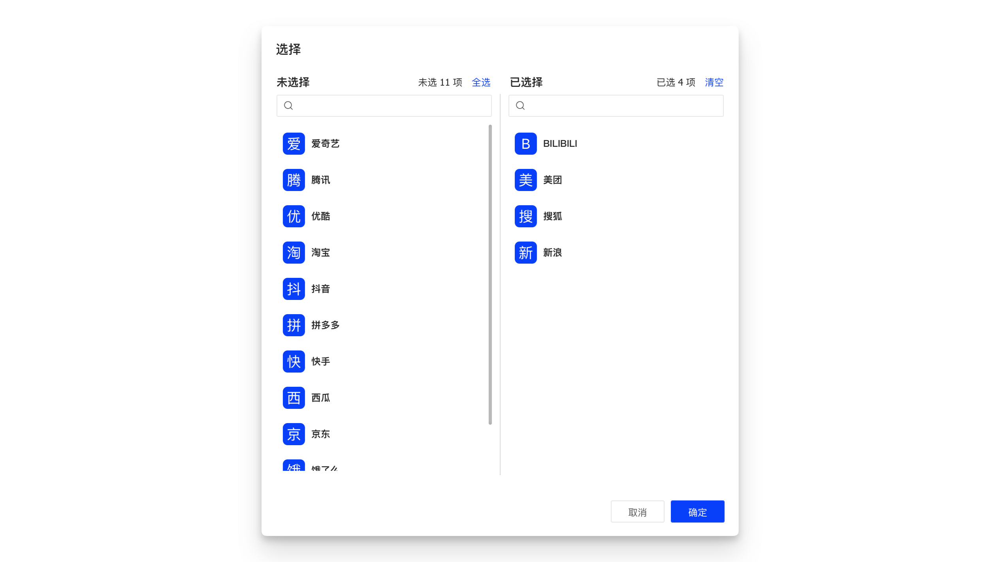

## 特性说明

`TransferProModal` 基于 `TransferPro` 实现，将 `Modal.open` 操作内置到组件中，默认渲染为 `Button`

## 基本用法

```tsx
<TransferProModal
  buttonProps={{
    funcType: FuncType.link,
    disabled: true,
  }}
  modalProps={{
    onOk: (args) => handleAssign(args, record),
  }}
  titles={[
    intl.get(`${intlPrefix}.title.unassignedTenants`).d('未分配租户'),
    intl.get(`${intlPrefix}.title.assignedTenants`).d('已分配租户'),
  ]}
  configProps={{
    primaryKey: 'tenantId',
    textField: 'tenantName',
    valueField: 'tenantNum',
    lovCode: 'HPFM.TENANT_PAGING',
    lovUrl: 'sql',
  }}
  targetProps={{
    primaryKey: 'assignTenantId',
    read: ({ data }) => {
      return {
        url: `${IPFM_API_PREFIX_BASE}/model-assigns`,
        method: 'GET',
        data: { ...data, modelId: record?.get('modelId') },
      };
    },
  }}
>
  {intl.get(`${intlPrefix}.button.assignment`).d('分配')}
</TransferProModal>,
```

## API

| 参数        | 类型               | 说明                                                                                                                                                                                                       | 默认值 |
| :---------- | :----------------- | :--------------------------------------------------------------------------------------------------------------------------------------------------------------------------------------------------------- | :----- |
| buttonProps | `ButtonProps`      | <Highlight>可选</Highlight> 按钮属性，默认 onClick 是打开弹窗，如果传入 onClick 事件，会先执行                                                                                                             |        |
| modalProps  | `TModalProps`      | <Highlight>可选</Highlight> 基于弹窗属性 [ModalProps](https://open.hand-china.com/choerodon-ui/zh/procmp/feedback/modal#API)，`key` `children` 除外，`onOk` 事件回调中会注入参数，[详细](#tmodalpropsonok) |        |
| 其他        | `TransferProProps` | 参见 [TransferProProps](/docs/C7N/CustomComponents/transfer-pro#api)                                                                                                                                       |        |

### ButtonProps.onClick

组件默认的 onClick 事件会打开弹窗，如果同时指定了 onClick 事件回调(异步)，则会先执行。

### TModalProps.onOk

`onOk` 回调中会注入以下参数：

| 参数         | 说明                                                                             |
| :----------- | :------------------------------------------------------------------------------- |
| originalData | <Highlight>数组</Highlight> 原始数据，目标数据源接口的返回数据                   |
| initialData  | <Highlight>数组</Highlight> 初始化数据，由 `originalData` 与源数据匹配之后的数据 |
| value        | <Highlight>数组</Highlight> 当前已选择的所有值                                   |
| created      | <Highlight>数组</Highlight> `value` 与 `initialData` 对比，新增的数据            |
| deleted      | <Highlight>数组</Highlight> `value` 与 `initialData` 对比，删除的数据            |

## Q & A
