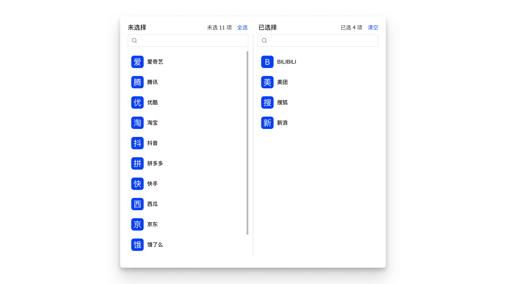

基于 `SelectBox` 组件封装的符合现行 `UED` 规范的简单易用的穿梭框组件。



## 特性说明

- 支持单选、多选，简单搜索
- 支持 `lovCode` `lookupCode` 值集配置
- 支持数据手动、自动加载
- 支持自定义渲染

## 基本用法

```jsx {3,10} showLineNumbers
export default () => {
  const handleAssign = async ({ originalData, initialData, value, created, deleted }) => {
    console.log(originalData, initialData, value, created, deleted);
    // call save api
  };

  const handleOpen = () => {
    Modal.open({
      title: '分配',
      onOk: handleAssign,
      children: (
        <TransferPro
          titles={['未分配租户', '已分配租户']}
          configProps={{
            primaryKey: 'tenantId',
            textField: 'tenantName',
            valueField: 'tenantNum',
            lovCode: 'HPFM.TENANT_PAGING',
            lovUrl: 'sql',
          }}
          targetProps={{
            primaryKey: 'assignTenantId',
            read: ({ data }) => {
              return {
                url: `${IPFM_API_PREFIX_BASE}/model-assigns`,
                method: 'GET',
                data: { ...data, modelId: record?.get('modelId') },
              };
            },
          }}
        />
      ),
    });
  };

  return (
    <Button funcType={FuncType.link} onClick={handleOpen}>
      分配
    </Button>
  );
};
```

## API

| 参数        | 类型                                                                    | 说明                                                                                                                                                               | 默认值                         |
| :---------- | :---------------------------------------------------------------------- | :----------------------------------------------------------------------------------------------------------------------------------------------------------------- | :----------------------------- |
| configProps | `ConfigProps`                                                           | <Highlight color="red">必输</Highlight> 穿梭框源与目标数据源 `DataSet` 配置，[详细](#configprops)                                                                  | -                              |
| targetProps | `TargetDSProps`                                                         | <Highlight color="red">必输</Highlight> 目标数据源补充配置，[详细](#targetprops)                                                                                   | -                              |
| searchable  | `boolean`                                                               | <Highlight>可选</Highlight> 是否支持搜索                                                                                                                           | `true`                         |
| titles      | `string[] 或 React.ReactNode[]`                                         | <Highlight>可选</Highlight> 左右侧标题                                                                                                                             | `["已选择","未选择"]`          |
| header      | `React.ReactNode`                                                       | <Highlight>可选</Highlight> 顶部自定义渲染                                                                                                                         | -                              |
| footer      | `React.ReactNode`                                                       | <Highlight>可选</Highlight> 地步自定义渲染                                                                                                                         | -                              |
| avatarProps | `AvatarProps`                                                           | <Highlight>可选</Highlight> 支持头像组件所有属性                                                                                                                   | `{ size: 28, shape: "square"}` |
| className   | `string`                                                                | <Highlight>可选</Highlight> 自定义类名                                                                                                                             | -                              |
| style       | `React.CSSProperties`                                                   | <Highlight>可选</Highlight> 自定义样式                                                                                                                             | -                              |
| modal       | `any`                                                                   | <Highlight>可选</Highlight> 使用 `Modal.open` 打开弹窗，默认会注入该参数，组件内部将目标数据结果注入到 `onOk` 回调中，[详细](./transfer-pro-modal#tmodalpropsonok) |                                |
| renderItem  | `(record: Record) => JSX.Element`                                       | <Highlight>可选</Highlight> 自定义 `Item` 渲染                                                                                                                     | -                              |
| onChange    | `({ records, value }: { records: Record[]; value: unknown[] }) => void` | <Highlight>可选</Highlight> 选择数据事件回调：单选、全选、清空。返回当前变更的记录及道当前右侧已选择的所有数据                                                     | -                              |

### ConfigProps

```ts
/**
 * @description lovCode,lookupCode 与 read 三选一
 */
export type ConfigProps =
  | {
      primaryKey: string;
      textField: string;
      valueField?: string;
    } & (
      | { lovCode: string; lookupCode?: undefined; read?: undefined }
      | { lovCode?: undefined; lookupCode: string; read?: undefined }
      | { lovCode?: undefined; lookupCode?: undefined; read: TransportType }
    );
```

:::info 注意
加载源数据的方式<Emphasis>只能且必须</Emphasis>选择 `lovCode` `lookupCode` 与 `read` 一种：值集 (列表) 的配置更为简洁， `read` 配置更为灵活。<br/>如果使用 `JS/JSX` 可能不会有类型错误提示，同时配置的话 `read` 优先级更高。
:::

| 参数       | 类型            | 说明                                                                                                                                                                  | 默认值       |
| :--------- | :-------------- | :-------------------------------------------------------------------------------------------------------------------------------------------------------------------- | :----------- |
| primaryKey | `string`        | <Highlight color="red">必输</Highlight> 主键，用于数据标识                                                                                                            | -            |
| textField  | `string`        | <Highlight color="red">必输</Highlight> 作为主要展示字段                                                                                                              | `textField`  |
| valueField | `string`        | <Highlight>可选</Highlight> 作为次要展示字段                                                                                                                          | `valueField` |
| lovCode    | `string`        | <Highlight>可选</Highlight> 值集编码，用于加载源数据                                                                                                                  | -            |
| lookupCode | `string`        | <Highlight>可选</Highlight> 值列表编码，用于加载源数据                                                                                                                | -            |
| read       | `TransportType` | <Highlight>可选</Highlight> 详细配置参见 [Transport](https://open.hand-china.com/choerodon-ui/zh/procmp/dataset/dataset#transport)，优先级高于 `lovCode` `lookupCode` | -            |

### TargetProps

:::info 注意
只接受 3 个参数。加载目标数据的方式<Emphasis>只能且必须</Emphasis>选择 `data` 与 `read` 其中一种：`data` 的配置需要手动请求数据，`read` 配置组件内部自动请求数据。同样 `read` 的优先级更高。

:::

```ts
/**
 * @description 目标数据源 DS 配置 data 与 read 二选一不能共存
 */
export type TargetProps = {
  primaryKey?: string; // 仅用于数据筛选, 默认值与 ConfigProps.primaryKey 一致
} & ({ data?: undefined; read: TransportType } | { data: unknown[]; read?: undefined });
```

| 参数       | 类型            | 说明                                       | 默认值                               |
| :--------- | :-------------- | :----------------------------------------- | :----------------------------------- |
| primaryKey | `string`        | <Highlight>可选</Highlight> 仅用于数据匹配 | 默认与 `ConfigProps.primaryKey` 一致 |
| data       | `Array<any>`    | <Highlight>可选</Highlight> 目标数据       | -                                    |
| read       | `TransportType` | <Highlight>可选</Highlight> 目标数据源配置 | -                                    |

:::caution 注意
`ConfigProps` 与 `TargetProps` 对返回数据的要求：<br/>
`Array` 或者 `{ content: Array }`，其他返回结果需要通过配置 `read.transformResponse` 自行格式转换。
:::
