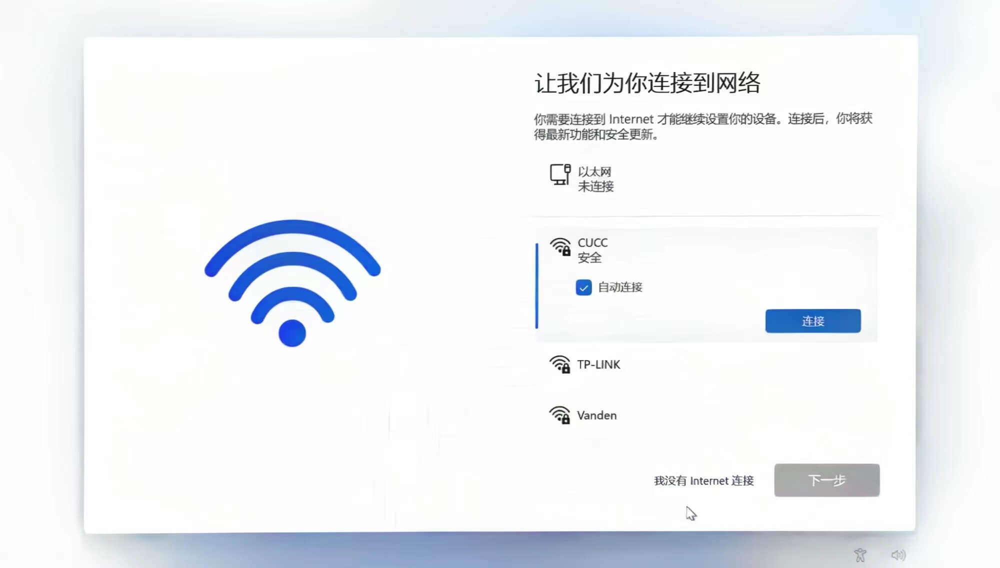
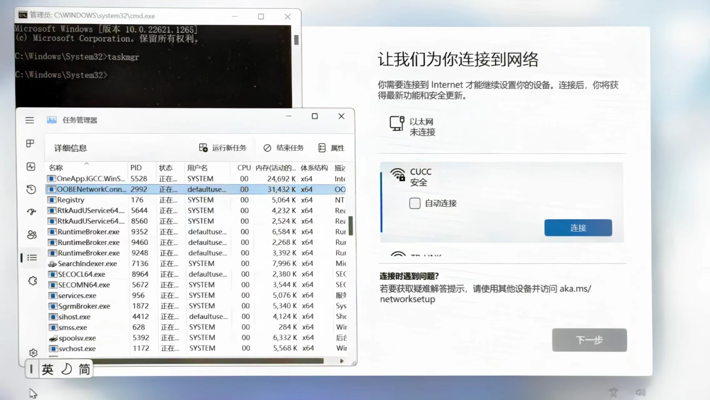
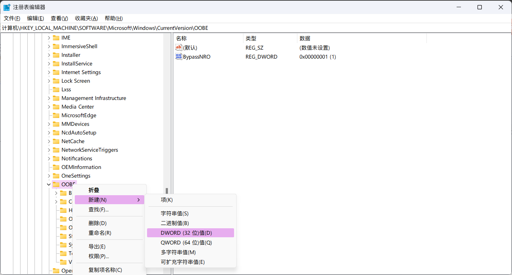

<Author count publish="2023-04-08 00:53:00" update="" />

## 方法 1: 我没有 Internet 连接

1. 快捷键 `Shift + F10` 或者 `Fn +Shift + F10` 打开命令行
2. 输入 `oobe\BypassNRO.cmd` 回车会自动重启，重启完成之后会出现【我没有 Internet 连接】选项



## 方法 2: 修改注册表

### 1. 终止网络连接进程

1. 快捷键 `Shift + F10` 或者 `Fn +Shift + F10` 打开命令行
2. 输入 `taskmgr` 打开任务管理器
3. 终止 `OOBE Network Connection Flow` 进程



> 执行完上述步骤之后，会出现刷新重试按钮。如果刷新之后不能跳过联网，那么需要修改注册表之后再刷新。

### 2. 修改注册表

1. 快捷键 `Shift + F10` 或者 `Fn +Shift + F10` 打开命令行
2. 输入 `rededit` 打开注册表
3. 在 `OOBE` 中新建 `DWORD`，字段名为 `BypassNRO`，将值修改为 1

```bash
# 注册表
计算机\HKEY_LOCAL_MACHINE\SOFTWARE\Microsoft\Windows\CurrentVersion\OOBE
```


