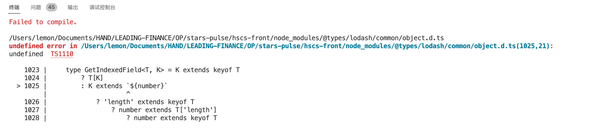
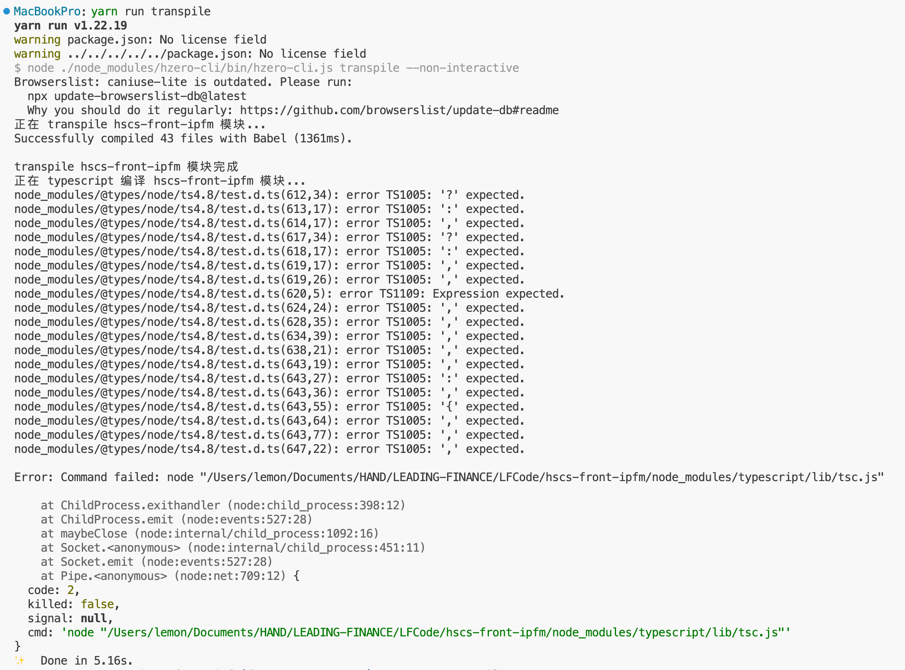
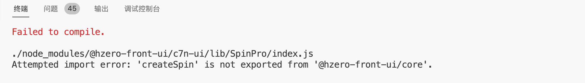

## undefined error in ... node_modules/@types/lodash/common/object.d.ts

**问题详情**



**解决方案**

版本问题

```json title="package.json"
{
  "resolutions": {
    "@types/lodash": "4.14.182"
  }
}
```

## node_modules/@types/node/ts4.8/test.d.ts(612,34): error TS1005: '?' expected.

**问题详情**

执行 `yarn run transpile` 时遇到此问题：



**解决方案**

版本问题

```json title="package.json"
{
  "resolutions": {
    "@types/node": "18.11.18"
  }
}
```

## Attempted import error: 'createSpin' is not exported from '@hero-front-ui/core'

**详情**



**原因**

`@hero-front-ui/core` 与 `@hero-front-ui/c7n-ui` 版本不匹配，`c7n-ui@4.1.2` 版本中组件引入发生了变化。

```js
// @hero-front-ui/c7n-ui@4.1.1
import { createSpin } from '../Spin';

// @hero-front-ui/c7n-ui@4.1.2
import { createSpin } from '@hero-front-ui/core';
```

**解决方案**

```json title="package.json"
{
  "resolutions": {
    "@hzero-front-ui/c7n-ui": "4.1.1"
  }
}
```

## 接口平台部分接口不通

后端 `1.9.3-RELEASE` 版本，前端需要使用 `hzero-front-hitf@1.9.1` 或更低版本。

## 项目依赖中二开的产品模块管理

指定依赖版本范围，防止拉取到其他依赖：

```json "package.json"
{
  "dependencies": {
    "hsie-front": ">=1.4.3-starspulse.0 <=1.4.3-starspulse.99"
  }
}
```

移除 `yarn.lock` 中产品依赖的版本锁定，避免每次埋点之后拉取不到最新依赖包，也可以避免每次移除 `yarn.lock` 重新解析全部依赖浪费时间的问题。

```yaml yarn.lock
hsie-front@>=1.4.3-starspulse.0 <=1.4.3-starspulse.99:
  version "1.4.3-starspulse.1"
  resolved "http://nexus.saas.hand-china.com/repository/..."
  integrity sha512-NqRb841vEtP82...
  dependencies:
    choerodon-ui "1.5.6"
    core-js "^3.6.4"
    hzero-front "1.9.3"
    react "^16.8.3"
    react-dom "^16.8.3"
```

对于项目中的二开模块，可以调整 `Jenkins` 执行脚本手动移除对应二开模块的 `dist` 包，避免二开模块不打包和全量打包太浪费时间的问题。
