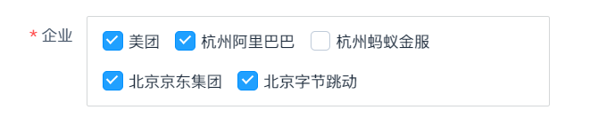

<Author count={3000} publish="2024-9-14 17:40" />

:::danger
✂️ 当前组件已停止更新维护，如遇问题，需自行修复！
:::

基于 `Element React` 的 `Checkbox.Group` 组件，结合 `DataSet` 的一些特性封装的多选组组件。



## 特性说明

- 支持 `dataSet` 自动获取值集数据渲染
- 支持 `options` `optionsData` 手动渲染
- 理论上支持 `CheckGroup` 组件除`onChange` 的所有属性（对 `onChange` 做了自定义封装，返回原始数据）

## 何时使用

- 在表单中需要使用平铺多选数据时

## 基本用法

```tsx showLineNumbers
import { CheckGroup } from '@/components/element-pro';

export default () => {
  const handleValueChange = (key: string, value: any, checked: any) => {
    console.log(key, value, checked);
  };

  return (
    <CheckGroup
      name="deptOrgName"
      dataSet={dataSet}
      value={model.deptOrgName}
      onChange={(val, checked) => handleValueChange('deptOrgName', val, checked)}
      disabled
    />
  );
};
```

## API

> 除此以下附加属性外，支持 `Checkbox.Group` 默认所有属性。

| 参数        | 类型 <div style={{minWidth:130}}/>    | 说明                                                                                                                                         | 默认值    |
| :---------- | :------------------------------------ | :------------------------------------------------------------------------------------------------------------------------------------------- | :-------- |
| value       | `any`                                 | <Highlight color="red">必输</Highlight> 绑定的 Element 表单 model 中的 value                                                                 | -         |
| name        | `string`                              | <Highlight>可选</Highlight> field name【未关联 DataSet 时不需要传入】                                                                        | `false`   |
| valueField  | `string`                              | <Highlight>可选</Highlight> 自定义 valueField                                                                                                | `value`   |
| textField   | `string`                              | <Highlight>可选</Highlight> Checkbox 不支持 valueField，需要保证 textField 唯一性                                                            | `meaning` |
| options     | `DataSet` \| `null`               | <Highlight>可选</Highlight> 用于手动渲染数据的 DataSet；优先级高于 dataSet                                                                   | -         |
| optionsData | ` Array<any>`                         | <Highlight>可选</Highlight> 用于手动渲染的数据，未使用 dataSet 的情况；优先级最高，高于 options                                              | -         |
| dataSet     | `DataSet` \| `null`                | <Highlight>可选</Highlight> 绑定的 dataSet，用于获取对应字段的 lookupCode 配置；优先级最低<br/>注意：使用查询参数时传入 dataSet.queryDataSet | -         |
| disabled    | `boolean`                             | <Highlight>可选</Highlight> 禁用状态                                                                                                         | `false`   |
| onChange    | `(value: any, checked?: any) => void` | <Highlight>可选</Highlight> 通过 textField 匹配返回原始数据 checked                                                                          | -         |

## 源代码

```tsx showLineNumbers title="CheckGroup/index.tsx"
import React from 'react';
import { Field, Record } from 'choerodon-ui/dataset';
import DataSet from 'choerodon-ui/dataset/data-set';
import cls from 'classnames';
import { Checkbox } from 'element-react';
import { isFunction } from 'lodash-es';
import { observer } from 'mobx-react';
import styles from './index.module.less';

type CheckboxGroupProps = React.ComponentProps<typeof Checkbox.Group>;

// WARNING: 开发阶段：组件 API 可能随时变更
/**
 * @see https://changnian.netlify.app/docs/c7n/custom-components/element-react/check_group
 */
export interface CheckGroupProps extends Omit<CheckboxGroupProps, 'onChange'> {
  /**
   * @description 绑定的 Element 表单 model 中的 value
   */
  value: any;
  /**
   * @description field name【未关联 DataSet 时不需要传入】
   */
  name?: string;
  /**
   * @description 支持 valueField，需要保证 textField 唯一性
   */
  valueField?: string;
  /**
   * @description Checkbox 不支持 valueField，需要保证 textField 唯一性
   */
  textField?: string;
  /**
   * @description 【优先级高于 dataSet】用于手动渲染数据的 DataSet
   */
  options?: DataSet;
  /**
   * @description 【优先级最高，高于 options】用于手动渲染的数据，未使用 dataSet 的情况
   */
  optionsData?: Array<any>;
  /**
   * @description 【优先级最低】绑定的 dataSet - 为了使用 dataSet 获取对应字段的 lookupCode 配置【注意：使用查询参数时传入 dataSet.queryDataSet】
   */
  dataSet?: DataSet | null;
  /**
   * @description 禁用状态
   * @default false
   */
  disabled?: boolean;
  /**
   * @description 通过 textField 匹配返回原始数据 checked
   */
  onChange?: (value: any, checked?: any) => void;

  bordered?: boolean;
}

const CheckGroup: React.FC<CheckGroupProps> = ({
  value,
  name,
  valueField: valField,
  textField: txtField,
  options,
  dataSet,
  optionsData,
  onChange,
  className,
  disabled = false,
  bordered = false,
  ...restProps
}) => {
  const field: Field | undefined = dataSet?.getField(name);

  // Checkbox 不支持 valueField，默认 value 与 textField 相等
  const textField = txtField || field?.pristineProps?.textField || 'meaning';
  const valueField = valField || field?.pristineProps?.valueField || 'value';

  const optionsDS = options || field?.options;

  const textValue = React.useMemo(() => {
    const checked: any[] = [];
    (value || []).forEach((val) => {
      (optionsData || optionsDS)?.forEach((opt) => {
        if (opt instanceof Record) {
          if (val === opt?.get(valueField)) {
            checked.push(opt?.get(textField));
          }
        } else if (typeof opt === 'string' || typeof opt === 'number') {
          if (val === opt) {
            checked.push(opt);
          }
        } else {
          if (val === opt?.[valueField]) {
            checked.push(opt?.[textField]);
          }
        }
      });
    });
    return checked;
  }, [value, optionsData, optionsDS]);

  // DEBUG: for debugging
  console.log('[CheckGroup]', value, textValue);

  const handleChange = (value) => {
    if (onChange && isFunction(onChange)) {
      if (value && value?.length) {
        const values: any[] = [];
        const checked: any[] = [];
        // 通过 valueField 匹配返回原始数据

        (optionsData || optionsDS)?.forEach((opt) => {
          if (opt instanceof Record) {
            if (value.includes(opt?.get(textField))) {
              checked.push(opt);
              values.push(opt?.get(valueField));
            }
          } else if (typeof opt === 'string' || typeof opt === 'number') {
            if (value.includes(opt)) {
              checked.push(opt);
              values.push(opt);
            }
          } else {
            if (value.includes(opt?.[textField])) {
              checked.push(opt);
              values.push(opt?.[valueField]);
            }
          }
        });

        onChange(values, checked);
      } else {
        onChange([], []);
      }
    }
  };

  return (
    <Checkbox.Group
      value={textValue}
      onChange={handleChange}
      className={cls(
        styles.check__group,
        {
          [styles['check__group--bordered']]: bordered,
        },
        className
      )}
      {...restProps}
    >
      {(optionsData || optionsDS)?.map((opt: Record | unknown) => {
        // record 渲染
        if (opt instanceof Record) {
          return (
            <Checkbox key={opt?.get(textField)} label={opt?.get(textField)} disabled={disabled} />
          );
        }
        // optionsData 渲染
        return <Checkbox key={opt?.[textField]} label={opt?.[textField]} disabled={disabled} />;
      })}
    </Checkbox.Group>
  );
};

export default observer(CheckGroup);
```

## 更新日志

### alpha

**2024-09-25**

- 🎉 新增 `valueField` 属性，`value` 属性调整为按值匹配；
- 🎉 新增 `bordered` 属性，支持调整是否展示边框；
- 🐞 修复空值未触发 `onChange` 的问题

**2024-08-05**

- 🎉 新增 `CheckGroup` 组件；
