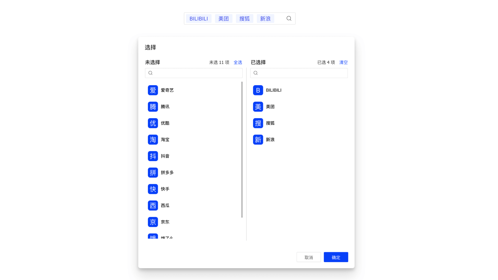

<Author count={2500} publish="2023-05-13 00:51:00" update="2023-05-24 13:55:00" />

基于 `TransferPro` 实现，将 `Modal.open` 操作内置到组件中，渲染为 `TextField` 组件。



## 特性说明

- 支持 `TransferPro` 所有特性
- 支持 `record` 数据绑定

## 基本用法

<Tabs>
<TabItem value="index" label="Index" default>

```tsx title="index.tsx"
import { useDataSet } from 'choerodon-ui/pro';
import { TransferProLov } from 'hscs-common/components';
import { getDSProps } from './store';

export default () => {
  const tenantDS = useDataSet(getDSProps, []);
  return <TransferProLov name="tenants" record={tenantDS.current} />;
};
```

</TabItem>
<TabItem value="data-set" label="DataSet">

```ts {10,42-45} showLineNumbers title="store/index.ts"
import { DataSetProps } from 'choerodon-ui/dataset/data-set/DataSet';
import { DataSetSelection, FieldIgnore, FieldType } from 'choerodon-ui/dataset/data-set/enum';

export const getDSProps = (): DataSetProps => {
  return {
    autoCreate: true,
    // 测试数据
    data: [
      {
        tenants: [
          {
            tenantName: '测试租户',
            createdBy: 2,
            tenantId: '52',
            enabledFlag: 1,
            tenantNum: 'TEST2',
            creationDate: '2022-02-25 10:46:59',
          },
          {
            tenantName: '自动化测试租户',
            createdBy: 2,
            tenantId: '51',
            enabledFlag: 1,
            tenantNum: 'AUTO_TEST',
            creationDate: '2022-02-25 10:46:17',
          },
          {
            tenantName: 'HZERO平台',
            createdBy: -1,
            tenantId: '0',
            enabledFlag: 1,
            tenantNum: 'HZERO',
            creationDate: '2021-08-30 12:11:04',
          },
        ],
      },
    ],
    fields: [
      {
        name: 'tenants',
        type: FieldType.object,
        lovCode: 'HPFM.TENANT_PAGING',
        idField: 'tenantId',
        textField: 'tenantName',
        valueField: 'tenantNum',
        ignore: FieldIgnore.always,
      },
      {
        name: 'tenantId',
        type: FieldType.string,
      },
      {
        name: 'tenantName',
        type: FieldType.string,
      },
    ],
    events: {
      update: ({ dataSet, record, name, value, oldValue }) => {
        console.log(dataSet, record, name, value, oldValue);
      },
    },
  };
};
```

</TabItem>
</Tabs>

## 在表单中应用

```tsx
import { TransferProLov } from 'hscs-common/components';

export default () => {
  return (
    <Form>
      <TransferProLov name="tenant" record={tenantDS.current} label="租户" />
    </Form>
  );
};
```

## API

| 参数        | 类型                                 | 说明                                                                                                                                                   | 默认值                          |
| :---------- | :----------------------------------- | :----------------------------------------------------------------------------------------------------------------------------------------------------- | :------------------------------ |
| name        | `string`                             | <Highlight color="red">必输</Highlight> 字段名称                                                                                                       | <div style={{ width: 50 }} /> - |
| record      | `Record` &#124; `undefined`          | <Highlight color="red">必输</Highlight> 关联的 `record`                                                                                                | -                               |
| configProps | `{data?:any; read?: TransportType }` | <Highlight>可选</Highlight> 源数据加载方式，仅当指定数据或自定义接口时用到                                                                             | -                               |
| modalProps  | `TLovModalProps`                     | <Highlight>可选</Highlight> 支持除 `key` `maskClosable` `children` `onOk` 以外的 `ModalProps` 所有属性                                                 | -                               |
| 其他        | `TransferProProps & FormFieldProps`  | 支持 `TransferPro` 除 `configProps` `targetProps` 外所有属性；支持 `FormFieldProps` 除 `dataSet` 所有属性。 [[1]](#为什么不支持-formfieldpropsdataset) | -                               |

## Q & A

### 为什么不支持 FormFieldProps.dataSet

可以，但没必要。应用场景类似于表单项，`record` 更方便直接取值；其次 `record.dataSet` 也能够获取关联的 `DataSet`。

### 这和 TransferButton 有什么不一样

内部实现不同：

- `Button` 更倾向于操作，不涉及回显；所以内部实现时 `Button` 可以在弹窗展开时加载数据；
- 而 `Lov` 更倾向于回显。故 `Lov` 在一开始就必须 (通过 `record`) 提供回显的数据，值的变更也会自动同步到绑定的 `record` 中，并触发 `dataSet` 的 `update` 事件。

## 更新日志

### 0.1.1

- 🎉 `hscs-front-common@0.1.1` 起支持该组件

### alpha

**2023-05-16**

- 🎉 新增 `ConfigProps.data` 支持手动加载源数据
