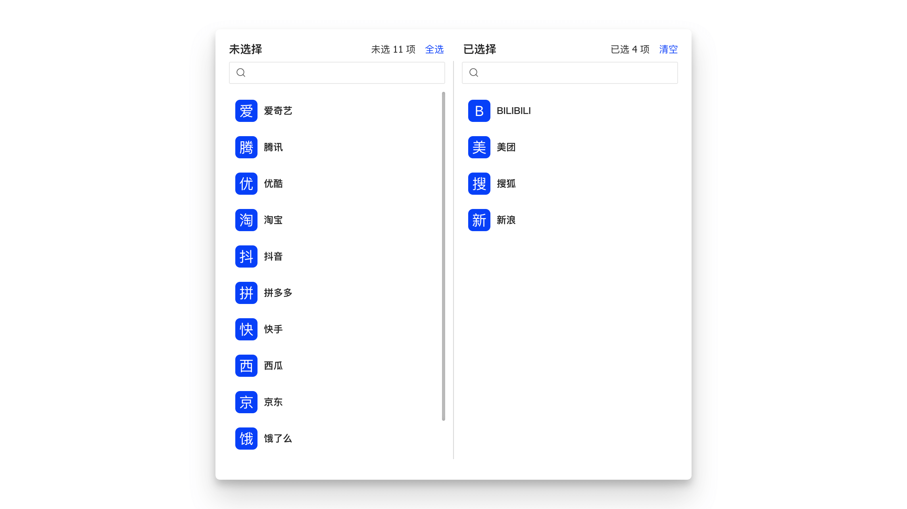

<Author cost={9} publish="2023-04-18 23:35:00" update="2023-12-24 22:50" />

:::danger
✂️ 当前组件已停止更新维护，该文档已归档并停止更新。
:::

基于 `SelectBox` 组件封装的符合现行 `UED` 规范的简单易用的穿梭框组件。



## 特性说明

- 支持单选、多选，简单搜索
- 支持 `lovCode/lookupCode` 值集配置
- 支持数据手动、自动加载
- 支持自定义渲染

## 基本用法

```jsx {5,12} showLineNumbers
import { TransferPro } from 'hscs-common/components';

export default () => {
  const handleAssign = async ({ originalData, initialData, value, created, deleted }) => {
    console.log(originalData, initialData, value, created, deleted);
    // call save api
  };

  const handleOpen = () => {
    Modal.open({
      title: '分配',
      onOk: handleAssign,
      children: (
        <TransferPro
          titles={['未分配租户', '已分配租户']}
          configProps={{
            primaryKey: 'tenantId',
            textField: 'tenantName',
            valueField: 'tenantNum',
            lovCode: 'HPFM.TENANT_PAGING',
          }}
          targetProps={{
            primaryKey: 'assignTenantId',
            read: ({ data }) => {
              return {
                url: `${API_PREFIX}/model-assigns`,
                method: 'GET',
                data: { ...data, modelId: record?.get('modelId') },
              };
            },
          }}
        />
      ),
    });
  };

  return (
    <Button funcType={FuncType.link} onClick={handleOpen}>
      分配
    </Button>
  );
};
```

## API

| 参数        | 类型                                                                    | 说明                                                                                                                                                                | 默认值                         |
| :---------- | :---------------------------------------------------------------------- | :------------------------------------------------------------------------------------------------------------------------------------------------------------------ | :----------------------------- |
| configProps | `ConfigProps`                                                           | <Highlight color="red">必输</Highlight> 穿梭框源与目标数据源 `DataSet` 配置，[详细](#configprops)                                                                   | -                              |
| targetProps | `TargetDSProps`                                                         | <Highlight color="red">必输</Highlight> 目标数据源补充配置，[详细](#targetprops)                                                                                    | -                              |
| searchable  | `boolean`                                                               | <Highlight>可选</Highlight> 是否支持搜索                                                                                                                            | `true`                         |
| titles      | `string[]` \| `React.ReactNode[]`                                       | <Highlight>可选</Highlight> 左右侧标题                                                                                                                              | `["已选择","未选择"]`          |
| header      | `React.ReactNode`                                                       | <Highlight>可选</Highlight> 顶部自定义渲染                                                                                                                          | -                              |
| footer      | `React.ReactNode`                                                       | <Highlight>可选</Highlight> 底部自定义渲染                                                                                                                          | -                              |
| avatarProps | `AvatarProps`                                                           | <Highlight>可选</Highlight> 支持头像组件所有属性                                                                                                                    | `{ size: 28, shape: "square"}` |
| className   | `string`                                                                | <Highlight>可选</Highlight> 自定义类名                                                                                                                              | -                              |
| style       | `React.CSSProperties`                                                   | <Highlight>可选</Highlight> 自定义样式                                                                                                                              | -                              |
| modal       | `any`                                                                   | <Highlight>可选</Highlight> 使用 `Modal.open` 打开弹窗，默认会注入该参数，组件内部将目标数据结果注入到 `onOk` 回调中，[详细](./transfer-pro-button#tmodalpropsonok) |                                |
| renderItem  | `(record: Record) => JSX.Element`                                       | <Highlight>可选</Highlight> 自定义 `Item` 渲染                                                                                                                      | -                              |
| onChange    | `({ records, value }: { records: Record[]; value: unknown[] }) => void` | <Highlight>可选</Highlight> 选择数据事件回调：单选、全选、清空。返回当前变更的记录及当前右侧已选择的所有数据                                                        | -                              |

### ConfigProps

```ts
/**
 * @description lovCode,lookupCode,data 与 read 四选一
 */
export type ConfigProps = {
  primaryKey: string;
  textField: string;
  valueField?: string;
} & (
  | { lovCode: string; lookupCode?: undefined; read?: undefined; data?: undefined }
  | { lovCode?: undefined; lookupCode: string; read?: undefined; data?: undefined }
  | { lovCode?: undefined; lookupCode?: undefined; read: TransportType; data?: undefined }
  | { lovCode?: undefined; lookupCode?: undefined; read?: undefined; data: any }
);
```

:::info 注意
加载源数据的方式<Emphasis>只能且必须</Emphasis>选择 `lovCode` `lookupCode` `data` 与 `read` 一种：值集 (列表) 的配置更为简洁， `read` 配置更为灵活。<br/>如果使用 `JS/JSX` 可能不会有类型错误提示，同时配置的话优先级顺序： `read` > `lovCode` \> `lookupCode` \> `data`。
:::

| 参数       | 类型            | 说明                                                                                                                                           | 默认值       |
| :--------- | :-------------- | :--------------------------------------------------------------------------------------------------------------------------------------------- | :----------- |
| primaryKey | `string`        | <Highlight color="red">必输</Highlight> 主键，用于数据标识                                                                                     | -            |
| textField  | `string`        | <Highlight color="red">必输</Highlight> 作为主要展示字段                                                                                       | `textField`  |
| valueField | `string`        | <Highlight>可选</Highlight> 作为次要展示字段                                                                                                   | `valueField` |
| data       | `any`           | <Highlight>可选</Highlight> 用于初始化源数据                                                                                                   | -            |
| lookupCode | `string`        | <Highlight>可选</Highlight> 值列表编码，用于加载源数据，优先级仅高于 `data`                                                                    | -            |
| lovCode    | `string`        | <Highlight>可选</Highlight> 值集编码，用于加载源数据，优先级高于 `lookupCode` `data`                                                           | -            |
| read       | `TransportType` | <Highlight>可选</Highlight> 详细配置参见 [Transport](https://open.hand-china.com/choerodon-ui/zh/procmp/dataset/dataset#transport)，优先级最高 | -            |

### TargetProps

```ts
/**
 * @description 目标数据源 DS 配置 data 与 read 二选一不能共存
 */
export type TargetProps = {
  primaryKey?: string; // 仅用于数据筛选, 默认值与 ConfigProps.primaryKey 一致
} & ({ data?: undefined; read: TransportType } | { data: unknown[]; read?: undefined });
```

:::info 注意
只接受 3 个参数。加载目标数据的方式<Emphasis>只能且必须</Emphasis>选择 `data` 与 `read` 其中一种：`data` 的配置需要手动请求数据，`read` 配置组件内部自动请求数据。同样 `read` 的优先级更高。
:::

| 参数       | 类型            | 说明                                                        | 默认值                               |
| :--------- | :-------------- | :---------------------------------------------------------- | :----------------------------------- |
| primaryKey | `string`        | <Highlight>可选</Highlight> 仅用于数据匹配                  | 默认与 `ConfigProps.primaryKey` 一致 |
| data       | `Array<any>`    | <Highlight>可选</Highlight> 目标数据                        | -                                    |
| read       | `TransportType` | <Highlight>可选</Highlight> 目标数据源配置，优先级高于 data | -                                    |

:::warning 注意
ConfigProps 与 TargetProps 对接口响应数据格式的要求：<br/>
HZERO 标准响应结构 `{ content: Array }` 或者数组 `Array`，其他返回结果需要通过配置 `read.transformResponse` 进行格式转换。
:::

## 源代码

```tsx title="TransferPro/index.tsx"
import { Record } from 'choerodon-ui/dataset';
import { RecordStatus } from 'choerodon-ui/dataset/data-set/enum';
import {
  Button,
  DataSet,
  Form,
  Output,
  SelectBox,
  Spin,
  Stores,
  useDataSet,
} from 'choerodon-ui/pro';
import { FuncType } from 'choerodon-ui/pro/lib/button/enum';
import type { TransportType } from 'choerodon-ui/pro/lib/data-set/interface';
import type { RenderProps } from 'choerodon-ui/pro/lib/field/FormField';
import type { SearchMatcherProps } from 'choerodon-ui/pro/lib/select/Select';
import cls from 'classnames';
import { isFunction } from 'lodash';
import { useObserver } from 'mobx-react-lite';
import * as React from 'react';
import { getResponse } from 'utils/utils';
import type { AvatarProProps } from '../AvatarPro';
import AvatarPro from '../AvatarPro';
import styles from './index.module.less';
import { ConfigProps, getFormDSProps, getLovDSProps, getTransferDSProps } from './store';

/**
 * @description 源数据中挑选目标需要的数据
 */
const pickDifference = (src: any[], trg: any[], srcKey: string, trgKey: string) => {
  return src
    .map((s: any) => {
      return trg.find((t) => `${t[trgKey]}` === `${s[srcKey]}`); // 类型不一致导致匹配不成功
    })
    .filter(Boolean);
};

/**
 * @description 从 src 中剔除 trg 中出现的数据
 */
const omitDifference = (src: any[], trg: any[], srcKey: string, trgKey: string) => {
  return src.filter((s: any) => {
    return !trg.find((t) => `${t[trgKey]}` === `${s[srcKey]}`); // 类型不一致导致匹配不成功
  });
};

/** @description 对比更改前后，返回新增、删除的数据 */
const getDifference = (originData: any[], currentData: any[], key: string): any[] => {
  const deleted = originData.filter((o) => !currentData.find((c) => c[key] === o[key])); // 删掉的
  const created = currentData.filter((c) => !originData.find((o) => c[key] === o[key])); // 新加的
  return [created, deleted];
};

/** @description 目标数据源 DS 配置 data 与 read 二选一不能共存 */
export type TargetProps = {
  primaryKey?: string; // 仅用于数据筛选, 默认值与 ConfigProps.primaryKey 一致
} & ({ data?: undefined; read: TransportType } | { data: unknown[]; read?: undefined });

export type TransferProProps = {
  /** @description 左侧源与右侧目标基础配置 */
  configProps: ConfigProps;

  /**
   * @description 右侧目标配置
   */
  targetProps: TargetProps;

  /** @description 标题 */
  titles?: string[] | React.ReactNode[];

  header?: React.ReactNode;

  footer?: React.ReactNode;

  className?: string;

  style?: React.CSSProperties;

  searchable?: boolean;

  /** @description 小头像属性设置 */
  avatarProps?: Omit<AvatarProProps, 'children'>;

  modal?: any;

  /** @description 选择数据事件回调：单选 & 全选 & 清空 */
  onChange?: ({ records, value }: { records: Record[]; value: unknown[] }) => void;

  renderItem?: (record: Record) => JSX.Element;
};

/**
 * @see https://changnian.netlify.app/docs/c7n/custom-components/transfer-pro
 */
const TransferPro: React.FC<TransferProProps> = ({
  titles = [],
  searchable = true,
  configProps,
  targetProps,
  avatarProps,
  onChange,
  renderItem,
  modal,
  style,
  className,
  header,
  footer,
}) => {
  const initRef = React.useRef<{ initialData: any[]; originalData: any[] }>({
    initialData: [], // 保存初始数据，用于返回最终变更
    originalData: [],
  });

  const [sourceTitle = '未选择', targetTitle = '已选择'] = titles;

  const { primaryKey, textField, valueField, lovCode, lookupCode, data: sourceData } = configProps;
  const trgPrimaryKey = targetProps?.primaryKey ?? primaryKey;

  const lovDS: DataSet | null =
    lovCode || lookupCode
      ? useDataSet(() => getLovDSProps({ lovCode, lookupCode }), [lovCode, lookupCode])
      : null;

  const formDS = useDataSet(getFormDSProps, []);
  const sourceDS = useDataSet(
    () => getTransferDSProps({ ...configProps, name: 'source' }),
    [configProps]
  );
  const targetDS = useDataSet(() => {
    const { read } = targetProps;
    return getTransferDSProps({
      primaryKey,
      textField,
      valueField,
      read: read as TransportType,
      name: 'target',
    });
  }, [primaryKey, textField, valueField, targetProps.read]);

  React.useEffect(() => {
    const getSourceData = async (): Promise<unknown[]> => {
      let sourceResp;
      if (sourceData) {
        sourceResp = sourceData;
      } else if (lovDS && lovCode) {
        await Stores.LovCodeStore.fetchConfig(lovCode); // 请求之前先获取并设置 lov 配置
        sourceResp = await lovDS.getField('lov')?.options?.query(1); // 值集
      } else if (lovDS && lookupCode) {
        const lookupAxiosConfig = Stores.LookupCodeStore.getAxiosConfig(lovDS.getField('lookup'));
        sourceResp = await Stores.LookupCodeStore.fetchLookupData(lookupAxiosConfig); // 值列表
      } else {
        sourceResp = await sourceDS.query(); // 自定义查询
      }
      if (!getResponse(sourceResp)) {
        return [];
      }
      return Array.isArray(sourceResp) ? sourceResp : sourceResp?.content;
    };

    const getTargetData = async (): Promise<unknown[]> => {
      const { read, data } = targetProps || {};
      if (read) {
        const targetResp = await targetDS.query();
        if (!getResponse(targetResp)) {
          return [];
        }
        return Array.isArray(targetResp) ? targetResp : targetResp.content;
      }
      return data || [];
    };

    // 初始化源与目标数据
    (async () => {
      const targetArr = await getTargetData();
      const sourceArr = await getSourceData();

      sourceDS.loadData(omitDifference(sourceArr, targetArr, primaryKey, trgPrimaryKey));
      const matchedItems = pickDifference(targetArr, sourceArr, trgPrimaryKey, primaryKey);

      targetDS.loadData(matchedItems);
      if (initRef.current) {
        initRef.current.initialData = matchedItems;
        initRef.current.originalData = targetArr;
      }
    })();
  }, [lovCode, lookupCode]);

  React.useEffect(() => {
    if (modal && modal.update) {
      const { onOk } = modal.props;
      if (onOk) {
        modal.update({
          onOk: () => {
            const { initialData, originalData } = initRef.current;
            const value = targetDS.toData();
            const [created, deleted] = getDifference(initialData, value, primaryKey);
            return onOk({
              initialData,
              originalData,
              value,
              created,
              deleted,
            });
          },
        });
      }
    }
  }, [targetDS, primaryKey]);

  /** @description 搜索 */
  const searchMatcher = ({ record, text }: SearchMatcherProps): boolean => {
    const _textField: string = ((record.get(textField) as string) || '').toLowerCase();
    if (Array.isArray(text)) {
      return text
        .filter((t) => Boolean(t.trim()))
        .some((t) => {
          return _textField?.indexOf(t.toLowerCase()) !== -1;
        });
    }
    return _textField?.indexOf(text.trim().toLowerCase()) !== -1;
  };

  /**
   * @description 单条数据操作
   * source -> target: add
   * target -> source: sync
   */
  const handleTransfer = (record: Record) => {
    const source = record.dataSet;
    const [target, status] =
      source.name === 'source' ? [targetDS, RecordStatus.add] : [sourceDS, RecordStatus.sync];
    const newRecord = new Record(record.toData(), target, status);
    source.remove(record, true); // force removed
    target.unshift(newRecord);

    if (onChange) {
      onChange({ records: [newRecord], value: targetDS.toData() });
    }
  };

  /** @description 节点渲染 */
  const optionRenderer = ({ record }: RenderProps): JSX.Element => {
    if (!record) {
      return <></>;
    }
    if (isFunction(renderItem)) {
      return renderItem(record);
    }
    const avatarText: string = record?.get(textField) || '-';

    return (
      <span
        className={styles[`option-item`]}
        onClick={() => handleTransfer(record)}
        style={{ ...style }}
      >
        <AvatarPro style={{ fontSize: 16 }} size={28} shape="square" {...avatarProps}>
          {avatarText}
        </AvatarPro>
        <span className={styles.title}>{record?.get(textField)}</span>
        {record?.get(valueField) && (
          <span className={[styles.title, styles.description].join(' ')}>
            {record?.get(valueField)}
          </span>
        )}
      </span>
    );
  };

  /**
   * @description 批量操作 - 状态处理与单条数据操作一致
   * @see handleTransfer
   * @param isClear 是否清空
   */
  const handleBatch = (isClear = false) => {
    const [source, target, status] = isClear
      ? [targetDS, sourceDS, RecordStatus.sync]
      : [sourceDS, targetDS, RecordStatus.add];

    const { records } = source;
    const newRecords = records.map((r) => new Record(r.toData(), target, status));
    source.removeAll(true);
    target.unshift(...newRecords);

    if (onChange) {
      onChange({ records: newRecords, value: targetDS.toData() });
    }
  };

  return useObserver(() => (
    <div className={cls(styles.wrapper__transfer, className)}>
      {header}
      <Form columns={2} className={styles['transfer-header__form']} style={{}}>
        <Output
          value={
            <div className={styles.header__output}>
              <span className={styles.title}>{sourceTitle}</span>
              <span>
                <span className={styles.total}>未选 {sourceDS.length} 项</span>
                <Button
                  className={styles.clear__button}
                  funcType={FuncType.link}
                  onClick={() => handleBatch(false)}
                >
                  全选
                </Button>
              </span>
            </div>
          }
        />
        <Output
          value={
            <div className={styles.header__output}>
              <span className={styles.title}>{targetTitle}</span>
              <span>
                <span className={styles.total}>已选 {targetDS.length} 项</span>
                <Button
                  className={styles.clear__button}
                  funcType={FuncType.link}
                  onClick={() => handleBatch(true)}
                >
                  清空
                </Button>
              </span>
            </div>
          }
        />
      </Form>
      <Spin spinning={sourceDS.status !== 'ready' || targetDS.status !== 'ready'}>
        <Form dataSet={formDS} columns={2} className={styles.transfer__form}>
          <SelectBox
            name="source"
            vertical
            searchable={searchable}
            options={sourceDS}
            searchMatcher={searchMatcher}
            optionRenderer={optionRenderer}
            className={cls(styles[`select-box`], styles[`select-box-source`])}
          />

          <SelectBox
            name="target"
            vertical
            searchable={searchable}
            options={targetDS}
            searchMatcher={searchMatcher}
            optionRenderer={optionRenderer}
            className={cls(styles[`select-box`], styles[`select-box-target`])}
          />
        </Form>
      </Spin>
      {footer}
    </div>
  ));
};

export default TransferPro;
```

```ts title="store/index.ts"
import { DataToJSON, FieldType } from 'choerodon-ui/dataset/data-set/enum';
import type { DataSetProps, TransportType } from 'choerodon-ui/pro/lib/data-set/interface';

/**
 * @description lovCode,lookupCode,data 与 read 四选一
 */
export type ConfigProps = {
  primaryKey: string;
  textField: string;
  valueField?: string;
} & (
  | { lovCode: string; lookupCode?: undefined; read?: undefined; data?: undefined }
  | { lovCode?: undefined; lookupCode: string; read?: undefined; data?: undefined }
  | { lovCode?: undefined; lookupCode?: undefined; read: TransportType; data?: undefined }
  | { lovCode?: undefined; lookupCode?: undefined; read?: undefined; data: any }
);

// 值集模式自动查询
export const getLovDSProps = ({
  lovCode,
  lookupCode,
}: {
  lovCode?: string;
  lookupCode?: string;
}): DataSetProps => {
  return {
    fields: [
      {
        name: 'lov',
        type: FieldType.object,
        lovCode,
        optionsProps: { pageSize: 99999 },
      },
      {
        name: 'lookup',
        type: FieldType.string,
        lookupCode,
        optionsProps: { pageSize: 99999 },
      },
    ],
  };
};

/**
 * 值集返回数据的要求，Array 类型或者是 { content: Array }，
 * 其他返回结果需要通过配置 transport.read.transformResponse 自行格式转换
 */
export const getTransferDSProps = (configProps: ConfigProps & { name: string }): DataSetProps => {
  const { name, primaryKey, valueField = 'value', textField, read } = configProps;

  return {
    name,
    primaryKey,
    pageSize: 99999, // 暂不支持分页
    selection: false,
    autoCreate: false,
    autoQuery: false, // 禁用自动查询
    dataToJSON: DataToJSON.all,
    transport: { read },
    fields: [
      { name: primaryKey, type: FieldType.string },
      { name: textField, type: FieldType.string },
      { name: valueField, type: FieldType.string },
    ],
  };
};

export const getFormDSProps = (): DataSetProps => {
  return { fields: [{ name: 'source' }, { name: 'target' }] };
};
```

## 更新日志

> 注：版本号对应 `hscs-front-common` 版本

### 0.1.18 (2023-7-21)

- 🐞 修复 `ConfigProps` 中 `read/data` 属性限制不完全问题

### 0.1.1

- 🎉 `hscs-front-common@0.1.1` 起支持该组件

### alpha

**2023-05-21**

- 🐞 修复 `lovCode/lookupCode` 查询顺序问题

**2023-05-16**

- 🎉 新增 `ConfigProps.data` 支持手动加载源数据
