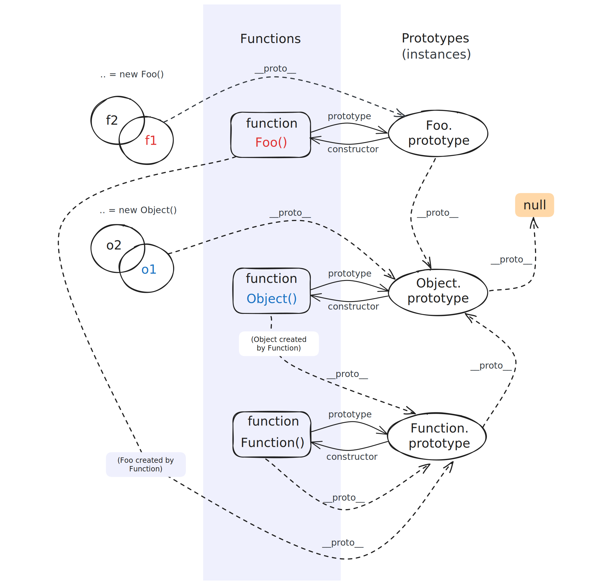

<Author cost={5} publish="2022-11-12" update="2024-1-3 23:30" />

当一个对象在查找一个属性 (或方法) 的时候，自身没有就会根据 `__proto__` 向它的原型进行查找，如果都没有，则向它的原型的原型继续查找，直到查到 `Object.prototype.__proto__` 为 `null`，这样也就形成了原型链。

:::tip Tips
在 `JavaScript` 中一切都是对象，在理解原型链时需分为函数 `Function` 和对象 `Object` 两大类。
:::

## 通用规则

在默认 `__proto__` 没有被修改的情况下：<br/>
`__proto__` 是对象 `obj` 的属性，指向该对象构造函数的 `prototype` (即`obj.constructor.prototype`)
`prototype` 是函数 `func` 的属性，指向一个对象 `func.prototype`

## 关于 prototype

函数的 `__proto__` 指向该函数构造函数的 `prototype`，那 `prototype` 到底是什么呢？<br/>
`prototype` 是在函数生成的时候系统自动创建的对象。默认包含 `2` 个属性：

- `constructor` 构造函数指向该函数本身
- `__proto__` 指向 `Object.prototype`，即这个对象是由 `Object` 生成的。

```js
function Foo() {}
typeof Foo.prototype;
// "object"

Foo.prototype;
// { constructor: Foo(){}, __proto__: Object } //此处为模拟输出

// 验证构造函数指向
Foo.prototype.constructor === Foo;
// true

// 验证 __proto__ 指向
Foo.prototype.__proto__ === Object.prototype;
// true
```

:::warning 重要
`func.prototype` 是一个对象：函数 `func` 的 `prototype` 属性指向 `func.prototype` 这个对象。
:::

## 一般情况

在默认 `__proto__` 没有被修改的情况，通用规则适用于下面的情况：

### 对象

```js
// 字面量创建对象，实际上我们是用 Object 函数来生成对象的
let obj = {};
obj.__proto__ === Object.prototype;
// true

// 使用 Object 函数来创建对象
let obj = Object();
obj.__proto__ === Object.prototype;
// true

// 使用自定义函数来创建对象
function Obj() {}
typeof Obj;
// "function"

let obj = new Obj();
obj.__proto__ === Obj.prototype;
// true
```

### 函数

因为函数也是对象，所以函数也存在 `__proto__` 属性。

:::info
所有 `function` 的构造函数都指向 `Function()` :
包括内置的构造函数 `Function()` `Object()` `Array()` `String()` ...
:::

```js
// 所有 function 的构造函数都指向 Function()
function fn() {}
fn.__proto__ === Function.prototype;
// true
```

`Function` 的构造函数指向本身：

```js
Function.__proto__ === Function.prototype;
// true
```

`Object` 等内置函数也指向 `Function`：

```js
Object.__proto__ === Function.prototype;
//true

Array.__proto__ === Function.prototype;
//true
```

## 特殊情况

特殊情况主要是 `Object()` 和 `Function()` 这两个函数：

### Object()

前面说到一般情况下函数 `func` 的 `prototype` 指向 `func.prototype` 对象，且 `func.prototype.__proto__` 指向 `Object`，但 `Object` 不同：

```js
Object.prototype.__proto__;
// null
```

如果 `Object.prototype.__proto__` 也指向 `Object`，那原型链就没有终点了，所以在 `JavaScript` 中规定其指向 `null`，`null` 就是原型链的终点。

#### 继承与原型

在发生类的继承时，子类的 `prototype.__proto__` 会指向父类的 `prototype`。

```js
// 父类
class Animal {
  constructor(name) {
    this.name = name;
  }
}

Animal.prototype.__proto__ === Object.prototype; // true

// 父类实例
const animal = new Animal('Animal');
animal.__proto__ === Animal.prototype; // true

//子类
class Cat extends Animal {}

Cat.prototype.__proto__ === Object.prototype; //false
// There is the difference
Cat.prototype.__proto__ === Animal.prototype; //true

// 子类实例
const cat = new Cat('Cat');
cat.__proto__ === Cat.prototype; // true
```

### Function()

`Function` 特殊的地方在于 `Function.prototype`是一个函数：

```js
typeof Function.prototype;
// "function"

// 这里适用通用规则(把 Function.prototype 直接看成一个 {对象} 去理解哦！)
Function.prototype.__proto__ === Object.prototype;
// true
```

如果按照一般规则把 `Function.prototype` 看成函数的话，那么应该有 `Function.prototype.__proto__ === Function.prototype` 就又会出现像 `Object` 中一样的循环引用问题，所以 JavaScript 规定 `Function.prototype.__proto__ === Object.prototype`，这样就使原型链有了唯一的终点 `null`。

## 附-原型链图


