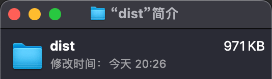
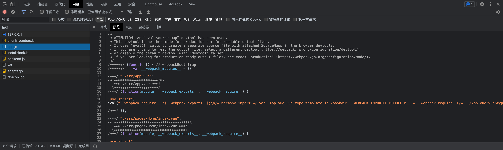
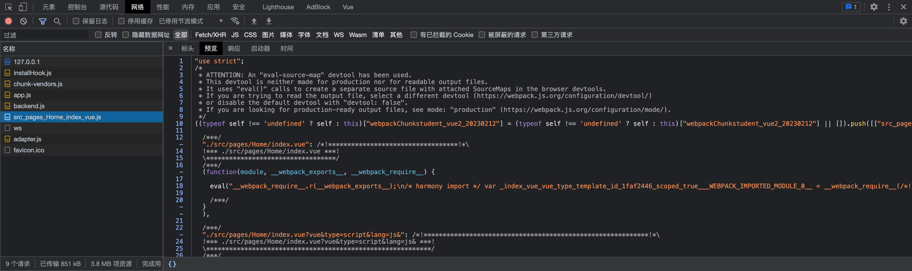

## 创建项目

### 命令行

> 基于 `vue-cli` 构建，`vite` 暂不支持 `vue2`。新版本的 `vue-cli` 允许选择 `vue` 的版本等。

```bash
vue create vue-app
```

可以通过提供参数跳过命令交互的选择操作。如果不熟悉命令，可以通过 `vue create -h` 查看所有命令，以下是常用命令：

| 命令参数缩写              | 命令参数全称     | 作用                            | 描述               |
| :------------------------ | ---------------- | ------------------------------- | ------------------ |
| `-m <package management>` | --packageManager | 指定包管理工具                  | 支持 npm yarn pnpm |
| `-r <url>`                | --registry       | 指定 npm 源                     | 仅 npm 支持        |
| `-f`                      | --force          | 如果同名文件存在，直接覆盖      |                    |
| `-g [message]`            | --git            | 强制 Git 初始提交并指定提交消息 |                    |
| `-n`                      | --no-git         | 不进行 Git 初始化               |                    |

### 用户界面

还可以通过图形界面创建项目，和命令行交互功能一致的。

```bash
vue ui
```

## 添加 element-ui

### 安装

```bash
yarn add element-ui

# or use npm
npm i emelent-ui -S
```

### 引入

在 main.js 中添加以下代码

```js
import ElementUI from 'element-ui';
import 'element-ui/lib/theme-chalk/index.css'; // element-ui 样式文件

Vue.use(ElementUI); // 全局挂载
```

### 应用

```html
<template>
  <el-button>hello</el-button>
</template>

<script>
  export default {
    name: 'HelloWorld',
  };
</script>
```

### 按需引入

> 可参考 `Element` 官网操作指引 [按需引入 - Element UI](https://element.eleme.cn/#/zh-CN/component/quickstart#an-xu-yin-ru)

**安装 babel-plugin-component 插件**

```bash npm2yarn
npm install babel-plugin-component -D
```

如果你使用的是 `Babel 7` 的话，安装 `@babel/preset-env`

```bash npm2yarn
npm install @babel/preset-env -D
```

如果不是 `Babel 7`，或者遇到报错可参考 [Vue 使用 Element 按需引入](https://wentao.blog.csdn.net/article/details/128999697?spm=1001.2014.3001.5502)

**修改 babel 配置文件**

```js
module.exports = {
  presets: ['@vue/cli-plugin-babel/preset', ['@babel/preset-env', { modules: false }]],
  plugins: [
    [
      'component',
      {
        libraryName: 'element-ui',
        styleLibraryName: 'theme-chalk',
      },
    ],
  ],
};
```

**创建配置文件**

创建 `src/config/element.config.js` 来管理 `element` 的组件引入与配置（创建配置文件是为了统一集中管理，避免 `main.js` 中代码过多，文件名和路径自定义）

```js
import Vue from 'vue';
import { Button } from 'element-ui';

Vue.use(Button);
// Vue.component(Button.name, Button); // 另一种写法, 可以为组件重命名
```

**在 main.js 中引用文件**

```js
import './config/element.config'; // 引入 element-ui 的配置
```

### 为什么使用按需引入

为了优化打包之后的文件大小，下图是在仅使用按钮组件的情况下，是否启用按需引入的打包结果对比：

| 优化前                                       | 优化后                                       |
| -------------------------------------------- | -------------------------------------------- |
|  |  |

## 添加 less

**安装**

```bash npm2yarn
npm i less less-loader
```

**使用**

```html
<style scoped lang="less">
  button {
    color: red; /* 测试 */
  }
</style>
```

## 添加 axios

## 添加 vue-router

### 安装

对于 `Vue 2` 推荐使用 `3.x` 版本。因为 `vue-router 4` 针对 `Vue 3` 做了适配，有一些 `API` 的变动，可能遇到问题。

```bash npm2yarn
npm i vue-router@3.6.5
```

### 应用

创建 `src/config/router.js` 统一管理路由配置（文件名和路径自定义）

```js
import VueRouter from 'vue-router';
import Home from '@/pages/Home/index.vue';

// 推荐这种写法, 有更好的提示
export default new VueRouter({
  mode: 'history',
  routes: [
    {
      path: '/',
      component: Home,
    },
  ],
});
```

在 `main.js` 中引用

```js
import router from './config/router'; // 路由

Vue.use(VueRouter);

new Vue({
  router,
  render: (h) => h(App),
}).$mount('#app');
```

在 `App.Vue` 中添加路由出口

```html
<template>
  <div id="app">
    <router-view></router-view>
  </div>
</template>
```

### 页面懒加载

#### 改为 import() 引入组件

```js
export default new VueRouter({
  mode: 'history',
  routes: [
    {
      path: '/',
      component: () => import('@/pages/Home/index.vue'),
    },
  ],
});
```

#### 为什么要懒加载

懒加载可以使代码打包时更好的分块，会将组件单独打包成一个文件，在需要访问时再请求资源，节省带宽。如下，可以在控制台发现使用懒加载时 `home` 文件是单独请求的。

| 无懒加载                            | 懒加载                           |
| :---------------------------------- | :------------------------------- |
|  |  |

> 如果遇到了页面不显示的问题，可以参考以下思路排查：

- `component` 是否是函数形式引入 `() => import('...')`
- `new Router()` 是否正确使用

## 添加 ESLint

**安装**

```bash npm2yarn
npm i eslint -D
```

**配置**

根目录下创建文件 `.eslintrc.js`，将 `package.json` 中的 `eslintConfig` 配置拷贝进来（直接在 `package.json` 中配置也可以）。在 `rules` 中添加对应的规则，如下禁用了 `vue` 组件名必须是两段式

> eslint 配置文件支持多文件格式 `js|json|yaml`，依据个人偏好选择。

```js
module.exports = {
  root: true,
  env: {
    node: true,
    browser: true,
  },
  extends: ['plugin:vue/essential', 'eslint:recommended'],
  parserOptions: {
    parser: '@babel/eslint-parser',
  },
  rules: {
    'vue/multi-word-component-names': 0, //vue 组件必须两段式
  },
};
```

## 添加 font-awesome

### 安装

这次尝试了最新的 `6.x` 版本，并且是采用了 `SVG + JS` 的渲染方式 [font-awesome official](https://fa6.dashgame.com/)

官方有具体的教程[font-awesome use with Vue](https://fontawesome.com/docs/web/use-with/vue/)

**安装核心包**

```bash npm2yarn
npm i @fortawesome/fontawesome-svg-core --save
```

**安装图标**

> 安装的都是免费的，可以在官网解锁 Pro 💰

```bash npm2yarn
npm i --save @fortawesome/free-solid-svg-icons
npm i --save @fortawesome/free-regular-svg-icons
npm i --save @fortawesome/free-brands-svg-icons

```

**安装字体组件**

> 注意 vue 版本

```bash npm2yarn
# for Vue 2.x
npm i @fortawesome/vue-fontawesome@latest-2 --save

# for Vue 3.x
npm i  @fortawesome/vue-fontawesome@latest-3 --save

```

### 应用

**引入**

创建文件 `src/config/font-awesome.config.js` 集中管理（文件名和路径自定义）

```js
import Vue from 'vue';
import { library } from '@fortawesome/fontawesome-svg-core'; //font-awesome core 核心包

import { FontAwesomeIcon } from '@fortawesome/vue-fontawesome'; //font-awesome 字体组件

import { faUserSecret } from '@fortawesome/free-solid-svg-icons'; // 特定图标

library.add(faUserSecret); // 添加图标到 library 中

Vue.component(
  'fa-icon',
  FontAwesomeIcon
); /* 将 font-awesome 组价声明为 Vue 组件, 这里为了方便注册为 fa-icon */
```

在 main.js 中引用

```js
import './config/font-awesome.config';
```

**使用**

> 注意：每添加一个图标都需要在 `config` 文件中引入

```html
<template>
  <fa-icon icon="fa-solid fa-user-secret" />
</template>
```
